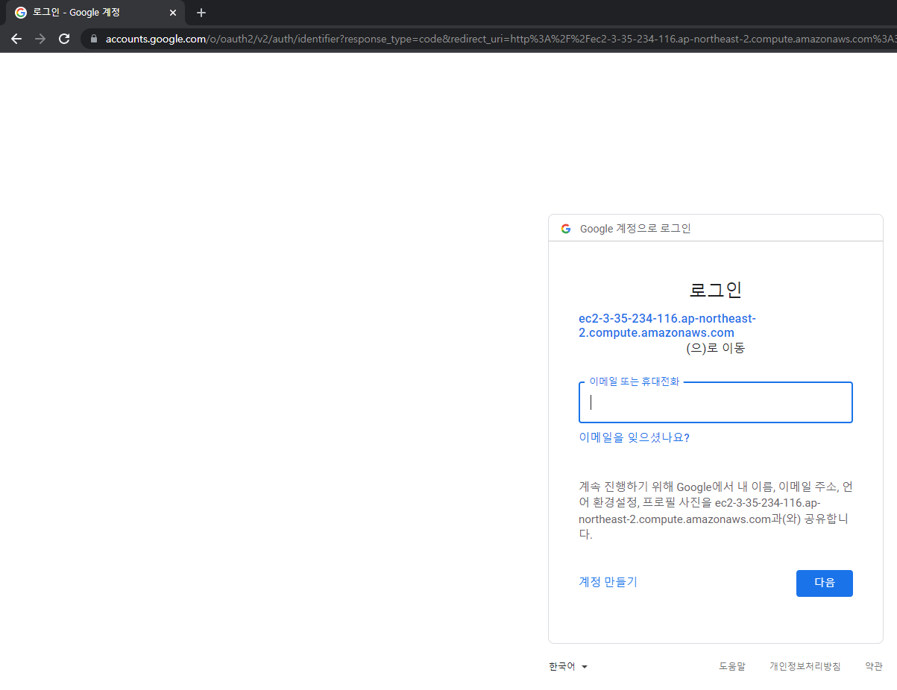
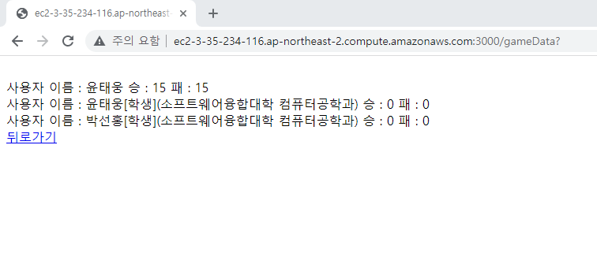
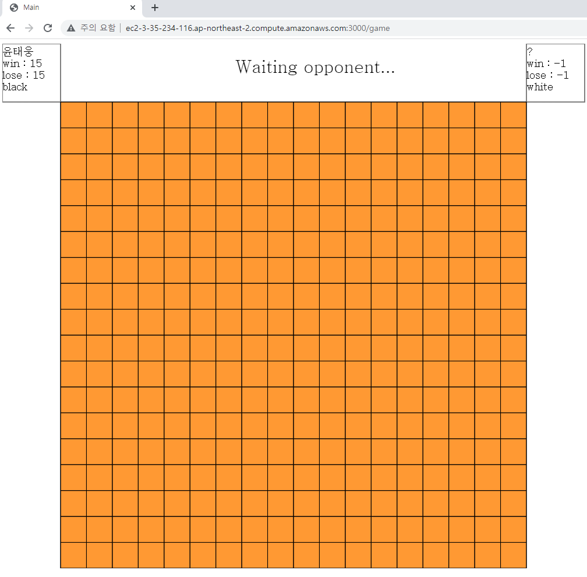
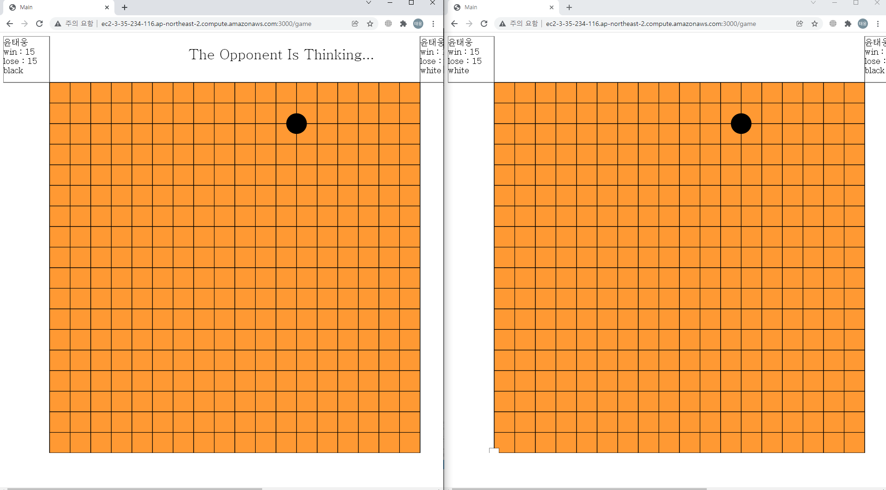
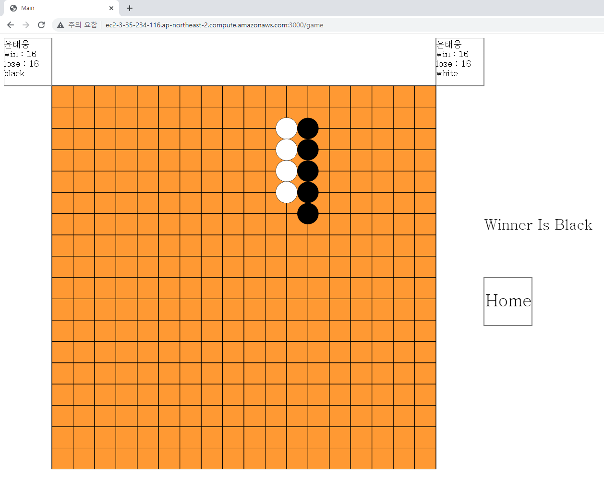
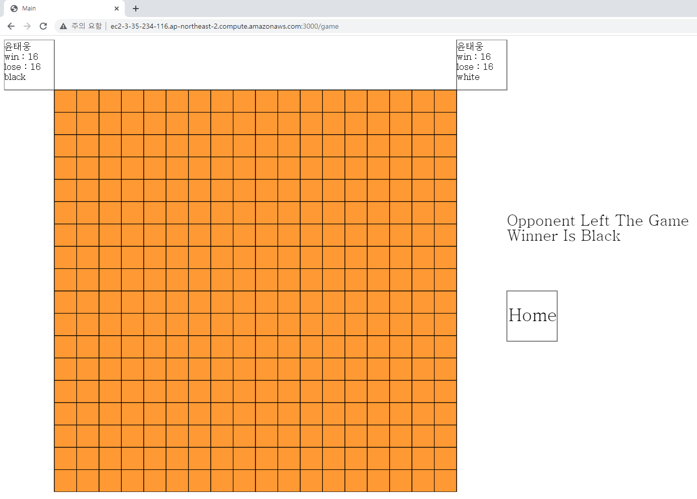

  

# 2021-2 오픈소스 텀프로젝트(웹 오목 대전 서비스)

  

## About The Project

  

* 사이트에 접속한 유저들이 로그인 과정을 거치고 서로 오목대전을 즐길 수 있도록 제공하는 서비스

  


  

- Client

	* html canvas로 그래픽표현

- Server & DB

	*  [Node.js](https://nodejs.org/ko/download/)

		* [socket.io](https://socket.io)

	*  [sqlite3](https://www.sqlite.org/index.html)

- External API
	
  * [Google API](https://console.cloud.google.com/)

  

## Getting Started

   aws로 제공하는 오목대전 서비스 접속 : [접속](http://ec2-3-35-234-116.ap-northeast-2.compute.amazonaws.com:3000)(경희대 메일+교수님 메일로 로그인 가능)

### Prerequisites

* nodejs 설치 [Node.js](https://nodejs.org/ko/download/)
* DB를 위한 별도의 설정은 없습니다.

  

### Installation

*  `git clone` 명령으로 프로젝트 폴더 clone

```
git clone http://khuhub.khu.ac.kr/2018102213/WebGomokuService.git
```

  

*  `npm install` 명령으로 npm 패키지 설치

```
npm install
```

  

### Google OAuth Client ID, Client Secret creation

* 다음 [블로그](https://www.a-mean-blog.com/ko/blog/%EB%8B%A8%ED%8E%B8%EA%B0%95%EC%A2%8C/_/Node-JS-%EC%84%9C%EB%B2%84%EC%97%90-%EA%B5%AC%EA%B8%80-%EC%86%8C%EC%85%9C-%EB%A1%9C%EA%B7%B8%EC%9D%B8-%EA%B8%B0%EB%8A%A5-%EB%84%A3%EA%B8%B0-1-2-Google-OAuth-Client-ID-Client-Secret-%EC%83%9D%EC%84%B1%EB%B0%A9%EB%B2%95)글에서 안내하는대로 OAuth Client ID, ClientSecret발급, call back url은 다음과 같이 설정

```
http://localhost:3000/auth/google/callback
```


  

* Google OAuth client ID를 GOOGLE_CLIENT_ID로, secret을 GOOGLE_SECRET로 시스템 환경 변수에 저장 or

config/passport.js의 process.env.GOOGLE_CLIENT_ID,process.env.GOOGLE_SECRET을 발급받은 OAuth CLient ID, ClientSecret으로 각각 대체하여 작성 후 저장

### Run

* main.js파일을 node.js로 실행

```
node main.js
```

* http://localhost:3000 로 접속


## Usage

  
  ### 이 어플리케이션은 구글 로그인으로 접속할 수 있습니다.
  
  ### 모든 유저의 승,패 횟수를 조회할 수 있습니다. 
  
  ### 이 게임은 플레이어와 플레이어간의 오목대전을 지원합니다. 2명의 플레이어가 순차적으로 사이트에 접속하면 게임이 바로 시작됩니다.
  
  ### 게임이 시작되면 자신의 턴에 마우스 클릭으로 돌을 둘 수 있습니다. 플레이어들은 번갈아 가며 돌을 두게 되고
  ### 먼저 5개의 연속된 돌을 만드는 사람이 승리합니다.
  
  ### 게임의 승부가 결정이 나면 승리자의 승수, 패배자의 패수가 증가합니다. 
  
  ### 게임 중간에 상대가 나가면 해당 방의 게임은 남아있는 사람의 승리로 처리됩니다.
  
  
  

## Roadmap

  - [x] NodeJs서버 개발환경 구축
  - [x] HTML canvas개발환경 구축
  - [x] 구글API 사용권한 취득
  - [x] 구글 로그인 구현
  - [x] socket.io를 통한 서버와 클라이언트간의 연결 확인
  - [x] 연결된 socket들을 관리하는  Room구현 
  - [x] 오목 게임 로직 구현
  - [x] sqlite3 데이터베이스 적용
  - [x] 데이터베이스 기능 구현
  - [x] 버그 수정, 그래픽 요소 수정
  - [x] AWS로 프로젝트 배포 

## Contribution

  개선사항이 있으시다면 다음 절차를 따라 직접 프로젝트에 기여해주실 수 있습니다.

1.  프로젝트 Fork
2.  Feature Branch생성
3.  Fork한 프로젝트에 Commit, Push
5.  Pull Request요청

## License
This project is licensed under the terms of the MIT license
## Contact

  

2018102213 윤태웅 15ywt@khu.ac.kr

  

프로젝트 주소 : http://khuhub.khu.ac.kr/2018102213/WebGomokuService 